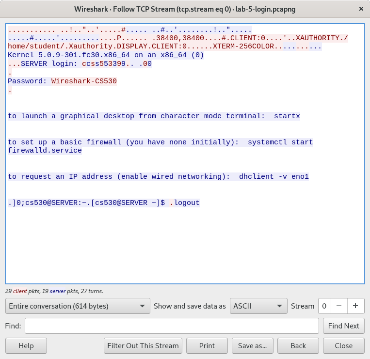
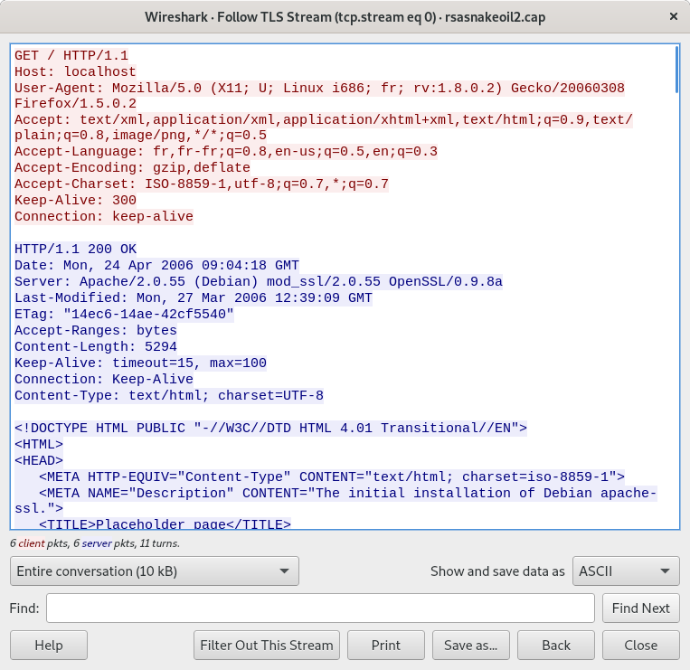

1. 14
2. 674
3. Rules:
    ```sh
    iptables --append INPUT --in-interface eth0 --protocol tcp --source-port 7 --jump DROP
    ```
4. *Question not Provided*
5. 1350
6. 1012
7. 1514
8. 1514
9.  1500
10. 14
11. Line-based text data
12. The maximum size of Ethernet's payload portion is 1500 bytes, as shown in the reference graphic. The frames in the capture file already have a payload size of 1500 bytes, so they can't be any larger.
13. Screen captures
    - Telnet
        
    - TLS decrypt
        
