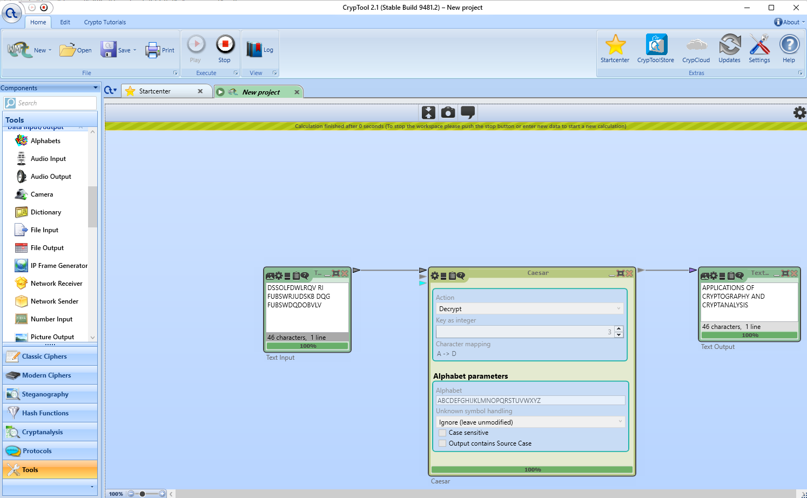
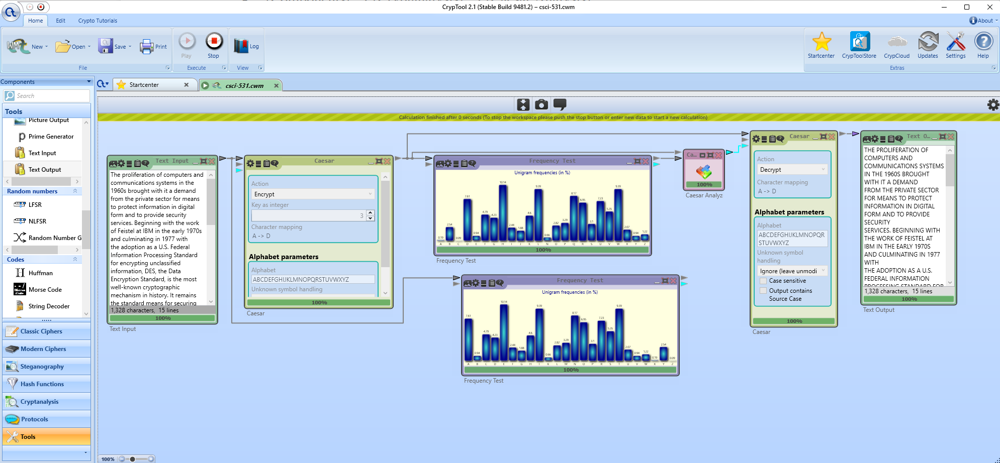
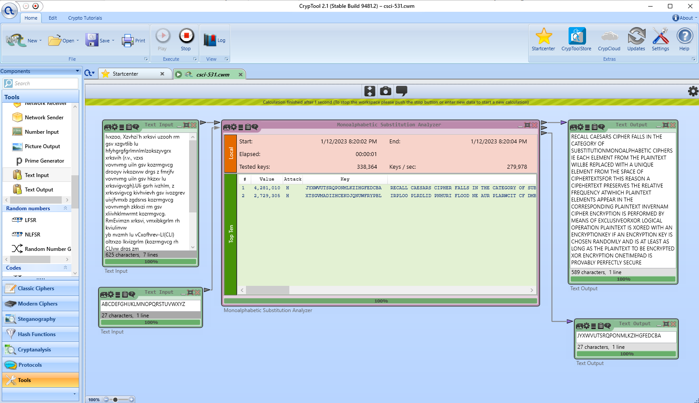
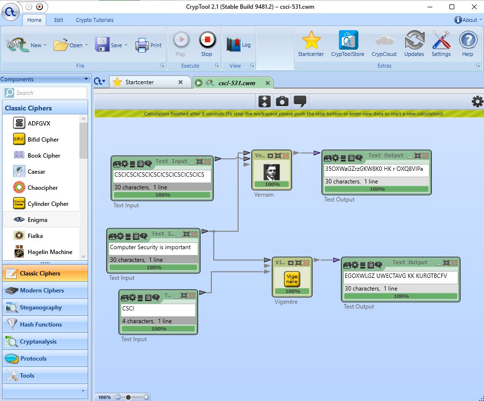
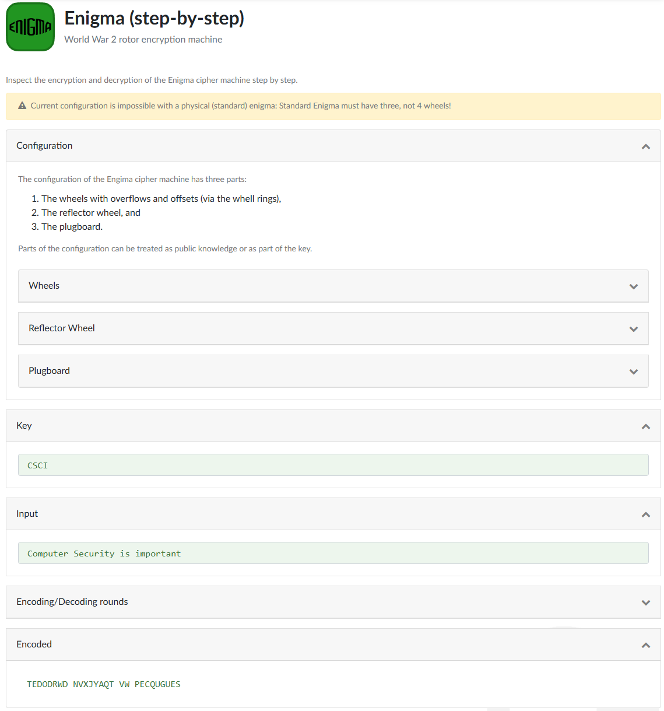

# Assignment 1

## Task 1

1. The plaintext is APPLICATIONS OF CRYPTOGRAPHY AND CRYPTANALYSIS.
    
2. The result Ci is equal to Mi because each encryption shifts the characters by 13, and two such encryptions shift a total of 26. This is equivalent to no shift at all.
3. 13 encryptions are needed, because a shift by a multiple of 26 characters is equivalent to no shift, and 13 shifts of K = 2 is equal to a shift by 26 characters.

## Task 2

Histograms for both the plain text and the cipher text are shown in the figure below. The histogram for the cipher text is a shifted version of the histogram for the plain text. For example, both peak at the letter E (or its corresponding cipher text H) with a maximum frequency of 10.14%, which can be use to determine the key for the Caesar cipher.

## Task 3

Plaintext: RECALL CAESARS CIPHER FALLS IN THE CATEGORY OF SUBSTITUTIONMONOALPHABETIC CIPHERS IE EACH ELEMENT FROM THE PLAINTEXT WILLBE REPLACED WITH A UNIQUE ELEMENT FROM THE SPACE OF CIPHERTEXTSFOR THIS REASON A CIPEHERTEXT PRESERVES THE RELATIVE FREQUENCY ATWHICH PLAINTEXT ELEMENTS APPEAR IN THE CORRESPONDING PLAINTEXT INVERNAM CIPHER ENCRYPTION IS PERFORMED BY MEANS OF EXCLUSIVEORXOR LOGICAL OPERATION PLAINTEXT IS XORED WITH AN ENCRYPTIONKEY IF AN ENCRYPTION KEY IS CHOSEN RANDOMLY AND IS AT LEAST AS LONG AS THE PLAINTEXT TO BE ENCRYPTED XOR ENCRYPTION ONETIMEPAD IS PROVABLY PERFECTLY SECURE

Key: ZYXWVUTSRQPONMLKJIHGFEDCBA

## Task 4

Vernam and Vignere cipher: 

Enigma:

