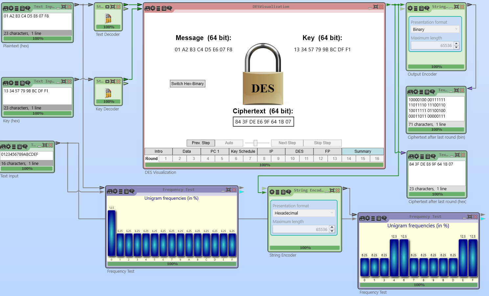
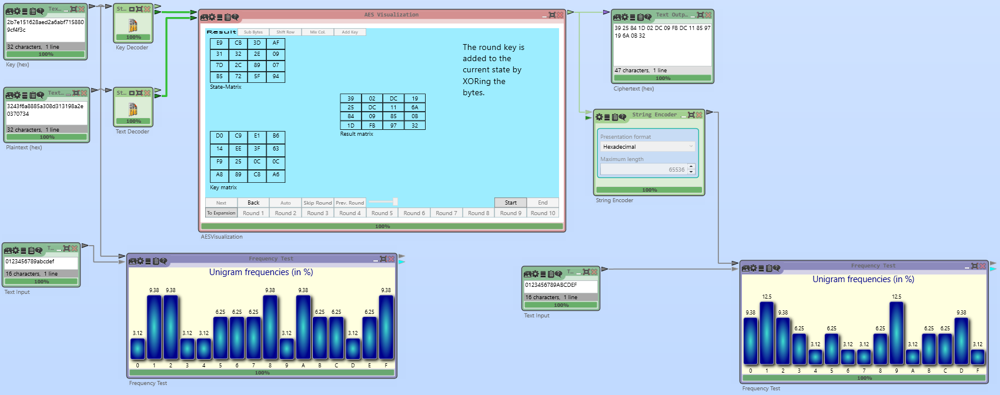
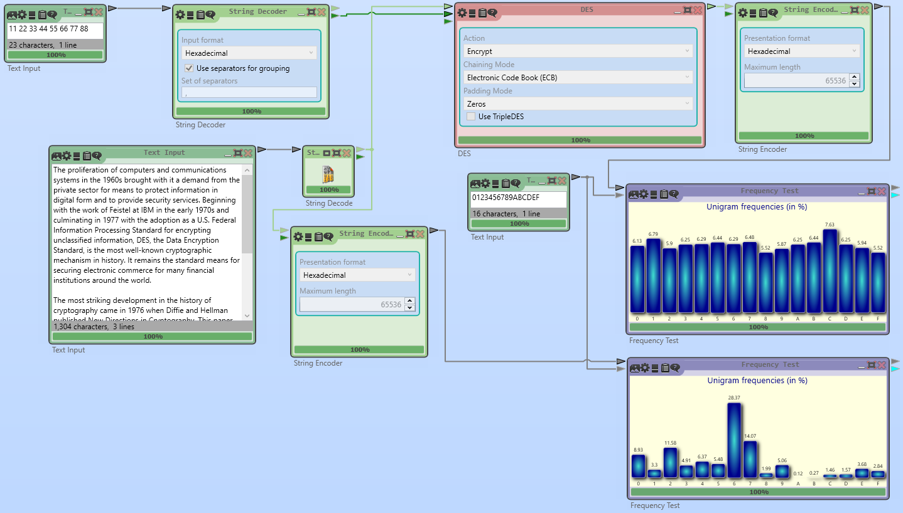

# Assignment 2

## Task 1

The screenshots for DES Visualization and AES Visualization with frequency histograms are attached below. The differences between the plaintexts' histograms and the ciphertexts' show the pseudorandom nature of these two encryption schemes: When the input to these block ciphers is close to the uniform distribution, the output may actually become less uniform.

## Task 2. Frequency Analysis of DES

**Note: Because there are two "Task 2" in the handout, we also have two sections titled "Task 2."**

The screenshot that includes both the plaintext and the ciphertext frequency histograms is attached below.

Comparing the plaintext histogram with the ciphertext histogram shows that DES makes the output hex distribution much closer to the uniform distribution. Compared with the results of frequency analysis for Caesar's Cipher, the plaintext and ciphertext histograms for DES exhibit no correlation.

## Task 2. Triple DES

1. When only one, instead of three, key is used, the ciphertext = EK(DK(EK(plaintext))) = EK(plaintext). That is, 3DES is equivalent to a single application of DES in this case, so the encrypted message can be decrypted using only regular DES.
2. The decryption process:
    1. Ciphertext: 58 FD 0F 30 D9 C9 43 F1 26 A1 E3 C1 74 78 B4 B8
    2. DK3(ciphertext)) = 73 CE F1 34 E4 E6 E7 83 8C EE 33 45 55 F2 BC 97
    3. EK2(DK3(ciphertext)) = 1A A3 D9 75 0E AC 9A 3A 14 2B FD 74 73 AA 20 DC
3. K2 enables "fast" decryption because in this case both keys are 16-byte long, meaning that the 3DES operates in the two-key mode. Since the two parts of K2 are the same, the actual three keys sent to 3DES are exactly the same and 3DES is actually equivalent a single application of DES, while the two parts of K1 are different and thus can't enable decryption with a single application of DES.

## Task 3. DES Encryption

1. The ciphertext for the first three plaintexts (no trailing zero, 2 trailing zeroes and 4 trailing zeroes) is F2 CC 9E 2A 8F 14 44 8D and the ciphertext for the last plaintext with 6 trailing zeroes is F2 CC 9E 2A 8F 14 44 8D 98 E5 86 34 9F 0C 5D B1. The ciphertexts for the first three plaintexts are the same because their difference in the number of trailing zeroes is removed by zero padding. Zero padding is required because the plaintexts' lengths are less than the block size. The ciphertext for the last plaintext is different from the first three because the plaintext's length is greater than the size of one block, so the plaintext is padded to two blocks before being encrypted and the output is two-block long.
2. The ciphertexts are shown below. They are all different because of how Cryptool's String Decoder converts bit strings to byte strings. When a bit string's size is not a multiple of eight (a byte's size), zeroes are inserted on the left to make its size a multiple of eight. For example, the first plaintext (the one without trailing zeroes) is converted to 00 01 in hex, while the second plaintext is converted to 00 04.
    1. 000000000001 → 10000101 00101010 00010001 11100011 01110000 10011111 10101100 10111001
    2. 00000000000100 → 11100110 11001100 10000100 10010101 01110010 11010111 10111010 11100000
    3. 0000000000010000 → 11001100 11110000 11000010 01000000 00011001 10110011 01001000 00001010
    4. 000000000001000000 → 10001001 11101000 00010110 00000101 11100100 01001011 00010111 10000111
3. The ciphertext for the first three plaintexts is F2 CC 9E 2A 8F 14 44 8D, same as that in 3.1, while the ciphertext for the last plaintext is F2 CC 9E 2A 8F 14 44 8D **7B 3D 76 28 40 17 7E 03** and different from that in 3.1. The ciphertexts for the first three plaintexts are the same because the IV is all zeroes and doesn't change the first block of input to DES when XORed with it. The ciphertexts for the last plaintext are different because the last plaintext is longer than a single block and CBC and ECB handle input differently for the second block. In ECB the second block of padded plaintext is directly passed to DES, while in CBC the input to DES is the XOR of the first ciphertext block and the second plaintext block.
4. The ciphertexts are all different and shown below. They are all different because the PKCS #7 padding scheme is a bijection: Every message has a corresponding unique padded message. Since the padded messages are all different, the ciphertexts should be different. Notably, because padding is only added to the last block, the first ciphertext block of the third and fourth plaintext are the same in ECB.
    1. 0000000000000000000000000001 → BC A2 58 54 48 61 57 DC 72 F2 1A 19 02 AF 1E A0
    2. 000000000000000000000000000100 → 7D F9 E8 6B B4 BF 34 4B CE 4F 63 1B FC 89 0C A0
    3. 00000000000000000000000000010000 → F0 05 63 CF 40 A6 FC 6B F1 D2 41 E2 90 5A DE 47 76 3C 28 5A 5B 1B 6E 17 75 01 D9 11 E5 BF D4 BA
    4. 0000000000000000000000000001000000 → F0 05 63 CF 40 A6 FC 6B F1 D2 41 E2 90 5A DE 47 18 39 FD 70 F8 23 9F D4 2C AA E7 48 F1 94 68 C8
5. The first two ciphertexts are the same as those in 3.4, so they are omitted here. The reason they are the same is similar to that in 3.3, that the IV is all zeroes. The reason that the third and fourth ciphertexts are different from those in 3.4 is also similar to the reason in 3.3, that in CBC the second plaintext block is XORed with the first ciphertext block but not so in ECB.
    1. 00000000000000000000000000010000 → F0 05 63 CF 40 A6 FC 6B F1 D2 41 E2 90 5A DE 47 26 13 5D 8E 64 A7 9F 0C 99 02 54 5E 89 57 D3 62
    2. 0000000000000000000000000001000000 → F0 05 63 CF 40 A6 FC 6B F1 D2 41 E2 90 5A DE 47 DA 54 9D 7F 01 96 B8 C4 49 51 7E 16 0C 0C B9 3F

## Task 4. "Cut-and-Paste" Attack on ECB and CBC Modes

1. The plaintext blocks are
    1. Bob’s_sa
    2. lary_is_
    3. $25000--
    4. Tom’s_sa
    5. lary_is_
    6. $15000.
2. Note that I replaced the "’" (U+2019 RIGHT SINGLE QUOTATION MARK) character in the message with "'" (U+0027 APOSTROPHE) so that the message is encodable in ASCII and each character corresponds to a single byte. The ciphertext blocks are
    1. AE 46 F7 21 FE D4 E8 28
    2. C3 45 4F 51 ED 2C ED CB
    3. FC EA 02 F1 22 C8 56 9F
    4. 31 9D 2E 19 D8 F9 82 42
    5. C3 45 4F 51 ED 2C ED CB
    6. C5 10 5E 0D 7A 9D 95 3F
3. The decoded message is "Tom's salary is $25000--Bob's salary is $15000." In the decoded message, the names "Tom" and "Bob" are exchanged due to the exchange of block C1 and C4's positions in the ciphertext.
4. The ciphertext blocks are shown below. The decrypted text in CBC mode is now corrupted and contains unprintable characters, unlike in ECB mode where the text is fully readable. This happens because the decryption of block Ck depends not only on itself but also its previous block. When C1 and C4 are exchanged, the blocks C1, C2, C4, C5 can be correctly decrypted. On data integrity, both ECB and CBC are likely to produce corrupted messages when blocks are modified, but only the CBC mode will produce corrupted messages when the order of ciphertext blocks is tampered with.
    1. AE 46 F7 21 FE D4 E8 28
    2. 97 5F FB A8 24 07 9D A0
    3. 37 6A E0 93 89 D8 0D 4C
    4. 8C 99 36 C3 83 B8 81 A9
    5. D4 70 C3 E2 D9 C4 66 C5
    6. F9 37 98 8A 39 24 7F 05

## Task 5

1. a. E4 D9 09 C2 90 D0 FB 1C A0 68 FF AD DF 22 CB D0 b. 128 bits
2. 1. 40 8D 94 38 42 16 F8 90 FF 7A 0C 35 28 E8 BE D1 E0 B0 16 21 
   2. 160 bits
   3. EF 53 7F 25 C8 95 BF A7 82 52 65 29 A9 B6 3D 97 AA 63 15 64 D5 D7 89 C2 B7 65 44 8C 86 35 FB 6C
   4. 256 bits
   5. ED 89 24 81 D8 27 2C A6 DF 37 0B F7 06 E4 D7 BC 1B 57 39 FA 21 77 AA E6 C5 0E 94 66 78 71 8F C6 7A 7A F2 81 9A 02 1C 2F C3 4E 91 BD B6 34 09 D7
   6. 384 bits
   7. 91 EA 12 45 F2 0D 46 AE 9A 03 7A 98 9F 54 F1 F7 90 F0 A4 76 07 EE B8 A1 4D 12 89 0C EA 77 A1 BB C6 C7 ED 9C F2 05 E6 7B 7F 2B 8F D4 C7 DF D3 A7 A8 61 7E 45 F3 C4 63 D4 81 C7 E5 86 C3 9A C1 ED
   8. 512 bits
3. 1. BD 1B 1A 94 33 57 2A F3 1F A7 51 6E D1 17 44 56
   2. Due to the use of a private key, a keyed hash function can be used to authenticate messages in communication where there may be an adversary who can tamper with the communication, while a regular (unkeyed) hash function can be used in a more benign scenario without adversary e.g., detecting file corruption on a hard drive.
4. The following two messages, encoded in hexadecimal, collide in their first 40 bits and have a difference of only 7 bytes. It took 394 279 246 tries.
    1. 31 32 33 34 35 36 37 38 39 30 31 32 33 34 35 36 37 38 39 30 31 32 33 34 35 36 37 38 0D 0A 21 21 20 50 52 45 46 49 58 20 21 21 0D 0A 30 31 32 33 34 35 36 37 38 39 30 31 32 33 34 35 36 37 38 39 79 DD A9 A3 28 B9 6D 52 CC 10 7B 68 29 9A EC 7A 8A 21 60 01 4D BB 4D F8 F8 09 82 81 8E 13 BB 2F 73 18 F9 F0 F2 2C DA 8A EB 23 F2 C2 A2 73 30 45 0D 2B B4 AF 11 E4 35 56 22 F9 28 82 5D EC 79 1A 0E 9C 5A 2B DF AD 38 45 E0 B7 09 21 41 DF 92 21 C7 70 FB 82 36 0D A1 4B 84 15 C4 47 5F 0C ED C1 19 2E C9 0A 75 CE A3 DF ED A0 EB B0 88 06 DD 24 07 E1 78 23 B7 9F F4 3A 39 1F C9 E8 79 00 FD 1D
    2. 31 32 33 34 35 36 37 38 39 30 31 32 33 34 35 36 37 38 39 30 31 32 33 34 35 36 37 38 0D 0A 21 21 20 50 52 45 46 49 58 20 21 21 0D 0A 30 31 32 33 34 35 36 37 38 39 30 31 32 33 34 35 36 37 38 39 79 DD A9 A3 28 B9 6D 52 CC 10 7B 68 29 9A EC 7A 8A 21 60 81 4D BB 4D F8 F8 09 82 81 8E 13 BB 2F 73 18 F9 F0 F2 2C DA 8A EB 23 F2 C2 A2 F3 30 45 0D 2B B4 AF 11 E4 35 56 22 F9 28 02 5D EC 79 1A 0E 9C 5A 2B DF AD 38 45 E0 B7 09 21 41 DF 92 21 C7 70 FB 02 36 0D A1 4B 84 15 C4 47 5F 0C ED C1 19 2E C9 0A 75 CE A3 DF ED A0 EB B0 88 86 DC 24 07 E1 78 23 B7 9F F4 3A 39 1F C9 68 79 00 FD 1D
5. 1. Introducing salt forces the adversary to run a separate exhaustive search for each password instead of looking up in a pre-computed table.
   2. In the Password Store example the salt is one-byte long, while in the Password Verification example the salt is four-byte long.
