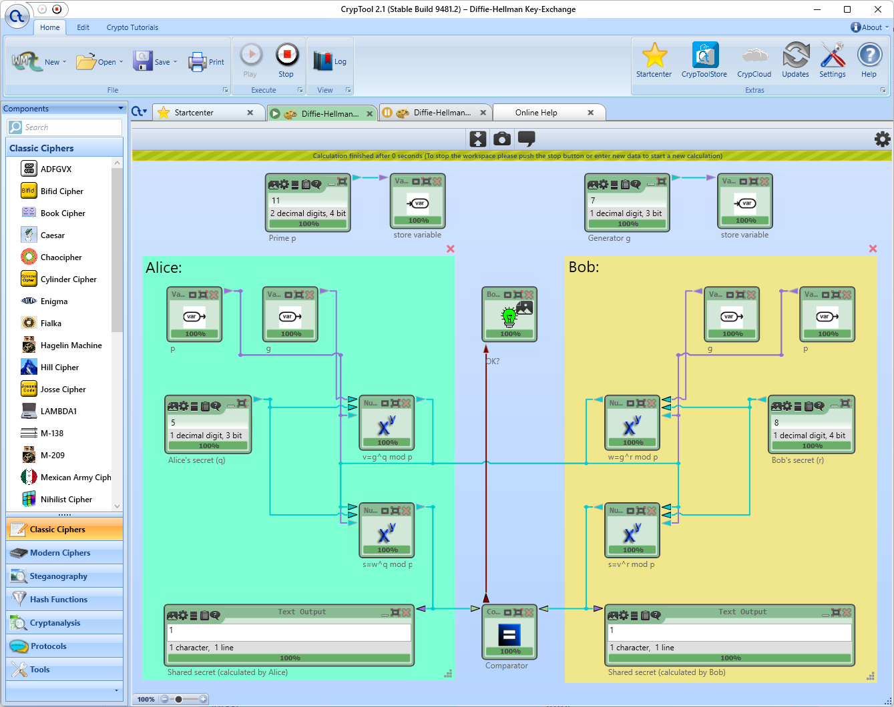
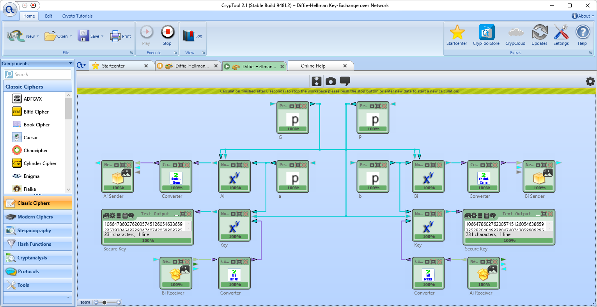
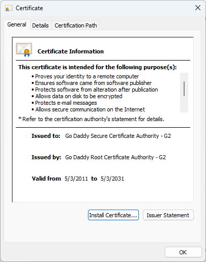
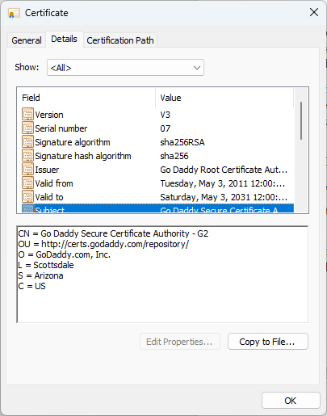
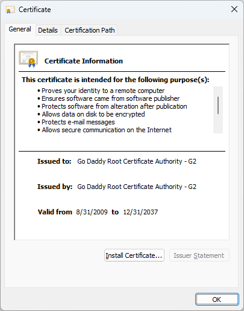
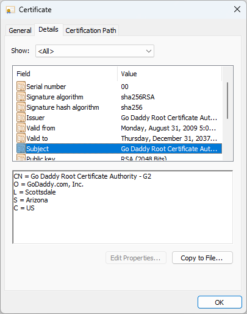

# CSCI 531 Assignment 3

## Task 1

The Diffie-Hellman Key-Exchange template shown in the screenshot below demonstrates the process of Diffie-Hellman key exchange with a generator of 7 in the cyclic group modulo the prime number 11. In the key exchange, Alice chose 5 as her exponent and Bob chose 8, and then they were able to compute the exchanged key with 7<sup>5 × 8</sup> mod 11 = 1.



The Diffie-Hellman Key-Exchange over Network template shown in the screenshot below demonstrates Diffie-Hellman key exchange over the network. A prime generator less than or equal to 512 and a prime modulus with at most 768 bits are randomly generated. Then two exponents a and b are generated for the two parties Ai and Bi in the key exchange and g<sup>a</sup> and g<sup>b</sup> are transferred over the network with UDP. Finally, Ai and Bi independently computed the exchanged key g<sup>ab</sup>.



## Task 2

1. The key management protocol is represented by the sequence diagram below:
    ```plantuml
    @startuml
    Alice -> Bob: Request confidential communication
    Alice -> Bob: r<sub>c</sub> || ID<sub>A</sub> || ID<sub>B</sub> || K<sub>A</sub>(r<sub>c</sub>, ID<sub>A</sub>, ID<sub>B</sub>)
    Bob -> KDC: K<sub>A</sub>(r<sub>c</sub>, ID<sub>A</sub>, ID<sub>B</sub>)
    Bob -> KDC: K<sub>B</sub>(r<sub>B</sub>, r<sub>C</sub>, ID<sub>A</sub>, ID<sub>B</sub>)
    KDC -> Bob: r<sub>c</sub> || K<sub>A</sub>(K<sub>AB</sub>) || K<sub>B</sub>(r<sub>B</sub>, K<sub>AB</sub>)
    Bob -> Alice: K<sub>A</sub>(K<sub>AB</sub>)
    Alice -> Bob: K<sub>AB</sub>("Hello")
    @enduml
    ```
2. The protocol is not secure against Bob's impersonation attack because any entity, say Eve, who have previously communicated with Alice can impersonate Bob, because they just need to replay the message K<sub>A</sub>(K<sub>AE</sub>) in the previous communication between Alice and Eve that contains the session key.
3. The protocol is also vulnerable to a more basic replay attack, that any adversary who obtains K<sub>A</sub>(M) and knows M can replay the message K<sub>A</sub>(M) to Alice to make Alice uses M as the session key. Unlike the attack in the previous answer, this attack doesn't require the adversary to have communicated with Alice.

## Task 3

The following two screenshots show the certificate for Go Daddy Secure Certificate Authority - G2, an intermediate certificate authority. Note that it is issued by a root CA.





The following two screenshots show the certificate for Go Daddy Root Certificate Authority - G2, a root CA. The certificate is issued by itself to itself and has a longer valid period than the intermediate CA.





## Task 4

1. TLS v1.3 mandates implementation of the TLS_AES_128_GCM_SHA256 cipher suite, which makes sure that the symmetric key is likely to have a key size of at least 128 bits and is computationally expensive to brute-force.
2. Similar to the previous answer, the likely symmetric key size of 128 bits makes the prohibitively large to store and use.
3. TLS handshake messages incorporate nonces to defend against replay attacks.
4. TLS requires server-side authentication with certificates to make it impossible for an adversary to impersonate a server.
5. Application-level messages transferred after the TLS handshake are encrypted with algorithms like AES.
6. TLS doesn't defend against IP address spoofing because TLS only protects application-level data and IP addresses are part of the network layer.
7. Confidentiality and integrity provided by TLS ensures that an attacker that doesn't know the session keys and disrupts the connection can't inject messages into the communication.
8. TLS doesn't defend against SYN flooding because SYN flooding targets TCP handshakes, which happens before any use of TLS.
