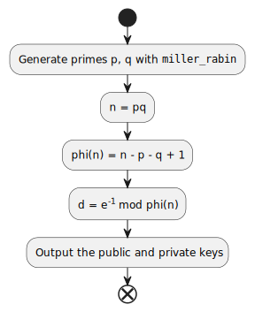
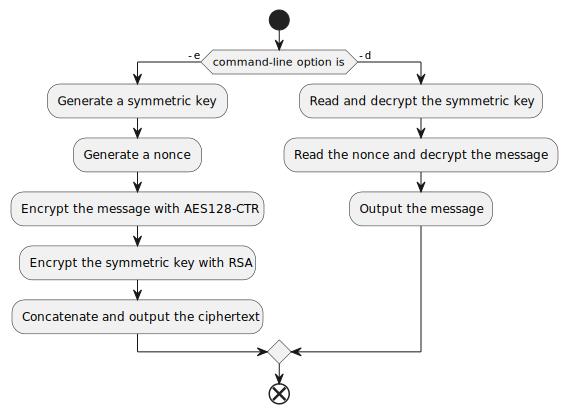

# CSCI 531 Programming Assignment 3 Design Document

The purpose of this project is to write two Python 3 scripts, `genkeys.py` and `crypt.py`, that implement hybrid encryption with RSA and AES: `genkeys.py` generates an RSA key pair, and `crypt.py` encrypts or decrypts the input file with RSA and AES. The main design goal of this project is correctness of implementation.

There are two kinds of persistent data in this project: RSA key files and the ciphertext file. The key files are of JSON format. The public key file's format is `{"e": "encryption exponent", "n": "RSA modulus"}` and the private key file's format is `{"d": "decryption exponent", "n": "RSA modulus"}`. The ciphertext file's format is binary and shown in the table below:

| Field                                             | Length / Byte |
|---------------------------------------------------|---------------|
| Length of the RSA-encrypted AES-128 symmetric key | 1             |
| Encrypted AES-128 symmetric key                   | Variable      |
| Nonce for AES in CTR mode                         | 16            |
| Encrypted message                                 | Variable      |

`crypt.py` depends on the `cryptography` Python library for AES encryption. The scripts provide command-line interfaces with help messages available by passing the `-h` argument.

Errors during execution are generally reported as uncaught Python exceptions. When decryption fails for a given combination of the secret key and the input file, the output file will have a length of zero.

The UML activity diagram below shows the implementation of `genkeys.py`. It uses the Miller-Rabin primality test to generate two prime numbers of 512 bits and then multiplies them together as the 1024-bit RSA modulus. The encryption exponent in the public key is chosen to always be 65537.



The UML activity diagram below shows the implementation of `crypt.py`.



## Demo

For better readability, the texts for the terminal session is reproduced below instead of a screenshot.

```
> python3 genkeys.py alice
> python3 genkeys.py bob
> cat message.txt
Cryptography, or cryptology, is the practice and study of techniques for secure communication in the presence of adversarial behavior.
> python3 crypt.py -e bob.pub message.txt message.cip
> hexdump -C message.cip
00000000  80 53 32 16 d1 9a 95 1b  38 bd 70 40 d6 12 7b a9  |.S2.�...8�p@�.{�|
00000010  7a 41 74 be 35 56 e6 e4  53 ce 6d bd 95 5a 5c c8  |zAt�5V��S�m�.Z\�|
00000020  2c 0a ef 65 fb ee 7c e6  66 d4 8e d0 72 7a de f8  |,.�e��|�f�.�rz��|
00000030  5b 26 2b af 87 a1 b6 c8  3b 0c fc 0a 05 b9 a7 ea  |[&+�.���;.�..���|
00000040  d0 f9 db c7 cf c1 20 bd  25 2c 25 de fc ea b3 12  |������ �%,%���.|
00000050  29 28 44 f9 a4 f0 d8 74  64 a3 07 b9 ff 0a c5 3c  |)(D����td�.��.�<|
00000060  43 38 c2 d3 d2 1b a0 04  e9 40 c7 66 c4 b2 cc fe  |C8���.�.�@�fIJ��|
00000070  c4 02 ae 8f 5f a4 42 4a  61 1e 44 4a 06 ae cf 95  |�.�._�BJa.DJ.��.|
00000080  b8 b5 3b 41 7e 0c e1 2a  e2 f3 8f 47 4e 95 da ef  |��;A~.�*��.GN.��|
00000090  40 0c b4 12 6c 06 94 24  9e 2d 7e cd 13 08 65 5d  |@.�.l..$.-~�..e]|
000000a0  c6 86 47 03 58 28 f9 d9  ed 78 38 66 98 22 26 1a  |�.G.X(���x8f."&.|
000000b0  11 ec 5f 06 99 c5 67 c0  95 ce d0 68 a8 ac 87 1e  |.�_..�g�.��h��..|
000000c0  dd 2b 4b e7 18 f1 b3 04  15 bb 2a 25 3b 92 61 50  |�+K�.�..�*%;.aP|
000000d0  06 dd 3d 78 4c ab 2a 71  6b 59 0a 32 3e a9 db 92  |.�=xL�*qkY.2>��.|
000000e0  1a e6 57 e6 65 c0 bb 8d  f3 01 ef 5d 09 b5 6a 88  |.�W�e��.�.�].�j.|
000000f0  22 d1 90 c9 af 74 5c a5  8b 51 38 46 a1 33 83 12  |"�.ɯt\�.Q8F�3..|
00000100  99 a3 ca 55 ec 4b e9 9e  a3 75 b8 37 b6 40 ac c9  |.��U�K�.�u�7�@��|
00000110  47 2a 40 07 9e 9b 35 06                           |G*@...5.|
00000118
> python3 crypt.py -d bob.prv message.cip message.txt
> cat message.txt
Cryptography, or cryptology, is the practice and study of techniques for secure communication in the presence of adversarial behavior.
> cat message2.txt
Cryptography, or cryptology, is the practice and study of techniques for secure communication in the presence of adversarial behavior.
> python3 crypt.py -e alice.pub message2.txt message2.cip
> hexdump -C message2.cip
00000000  80 3b 9c de e1 ad 7c 0a  e6 7a 1d 8f 15 4a 5a 0c  |.;.��|.�z...JZ.|
00000010  66 09 b6 ff b0 1c ee 48  2d 72 5c fe 24 ef 70 0a  |f.���.�H-r\�$�p.|
00000020  c8 64 e0 fc 1f 04 33 c0  b9 92 5a c0 26 f7 4c 8c  |�d��..3��.Z�&�L.|
00000030  bb 1f dd 46 12 4e 49 a5  6e 22 22 d6 ce 20 91 c6  |�.�F.NI�n""�� .�|
00000040  b0 7e 73 93 41 74 a1 41  81 80 0e 1d 51 3b 4d cf  |�~s.At�A....Q;M�|
00000050  9c 56 af 6d 9a 5b c9 68  64 de 87 30 a9 7d cc ca  |.V�m.[�hd�.0�}��|
00000060  ab 1f 0f 59 82 1c 02 38  71 0e 71 d4 d3 cf e7 e0  |�..Y...8q.q�����|
00000070  03 3d f6 50 b1 46 1a 78  40 6f 7c bc 2f 81 f3 53  |.=�P�F.x@o|�/.�S|
00000080  ab 58 48 c0 31 37 08 32  42 f1 b0 e9 1f e3 96 67  |�XH�17.2B��.�.g|
00000090  5d 4d 16 aa 97 ff 7d 68  b1 18 12 d9 cf 18 c3 ca  |]M.�.�}h�..��.��|
000000a0  18 ae 3a 9f 19 f5 00 61  0f 9a 63 92 a0 a7 f2 3a  |.�:..�.a..c.���:|
000000b0  de 52 bd 9b dd da aa 37  95 22 2d e9 0e 2b ba f9  |�R�.�ڪ7."-�.+��|
000000c0  62 87 9f 29 66 6a c0 ce  ff 89 56 5b 7c 84 51 70  |b..)fj���.V[|.Qp|
000000d0  71 ef de 93 27 5d a9 40  7d 9f 71 e2 30 b1 f2 85  |q��.']�@}.q�0��.|
000000e0  0c 22 e8 4a 6e 49 df 96  b1 d2 8f 56 62 0d 37 a3  |."�JnI�.��.Vb.7�|
000000f0  d3 9a 69 a2 30 ce e3 bb  3a 27 62 dd b8 7c 2f 6b  |�.i�0��:'bݸ|/k|
00000100  fc 52 85 59 61 1a b0 ac  f4 75 e9 21 c7 2b d6 dc  |�R.Ya.���u�!�+��|
00000110  48 0c ca e5 e3 2b 8a 91                           |H.���+..|
00000118
> python3 crypt.py -d alice.prv message2.cip message2.txt
> cat message2.txt
Cryptography, or cryptology, is the practice and study of techniques for secure communication in the presence of adversarial behavior.
```
