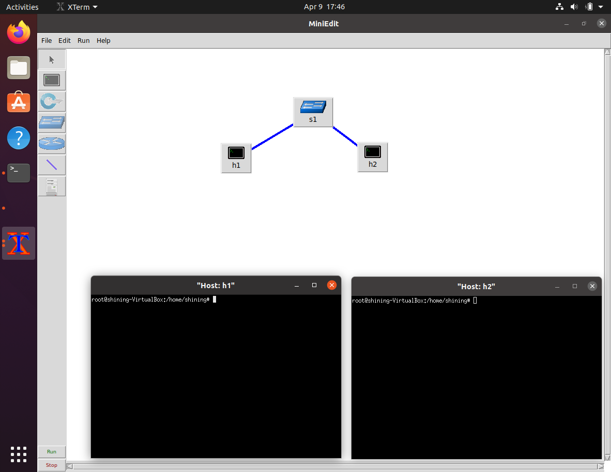
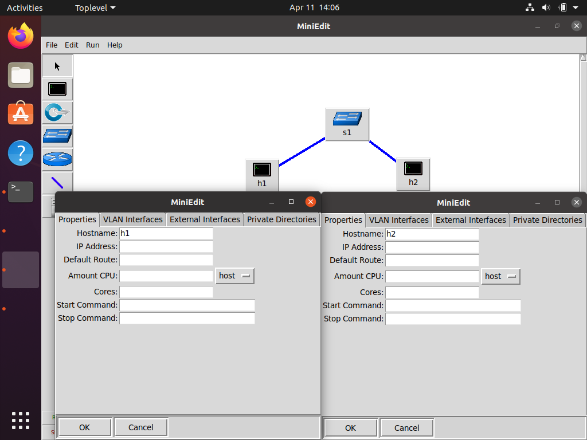
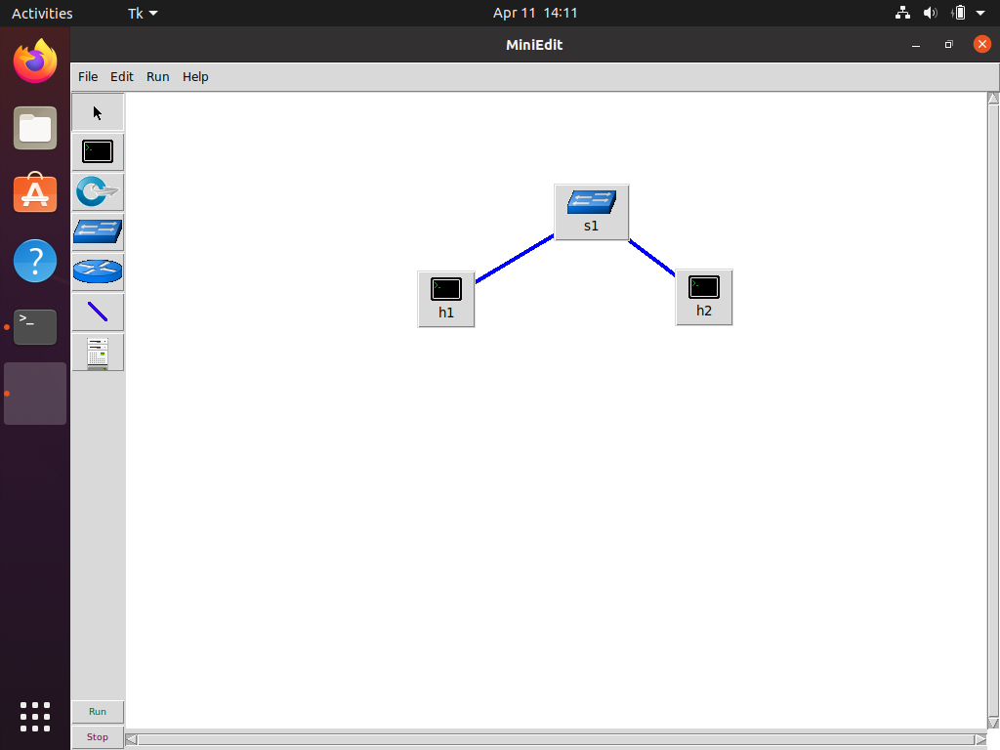
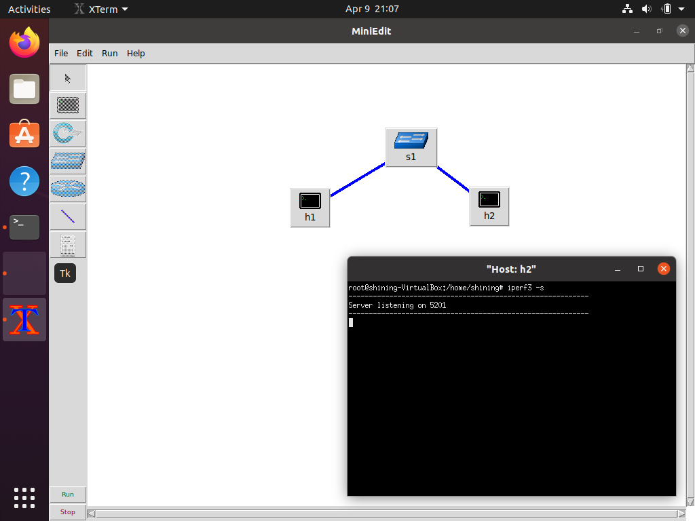

## Abstract

We follow steps in the lab guides with Mininet 2.3.1b1 and iperf3 3.7 on Ubuntu 20.04 and show the results as screenshots in this lab report.

All screenshots in the rest of the report show the state of the screen *after* the given instructions are completed. They are placed in ordered lists whose order corresponds to the order of the steps in the lab guides. For example, the screenshot for "Step 1" is contained in the item numbered "1." in the ordered list. Each screenshot is accompanied by a short text that describes the actions taken and notable deviation from given instructions (if any).

## Lab 1: Introduction to Mininet

### 2 Invoking Mininet using the CLI

#### 2.1 Invoking Mininet using the default topology

1. A Linux terminal was launched.
    
2. Mininet with a minimal topology was started.
    
3. Executed the `help` command.
    
4. Executed the `nodes` command.
    
5. Executed the `net` command.
    
6. Executed `ifconfig` on host h1 with `h1 ifconfig`.
    

#### 2.2 Testing connectivity

1. Pinged host h2.
    
2. Stopped the emulation with `exit`.
    

### 3 Building and emulating a network in Mininet using the GUI

#### 3.1 Building the network topology

1. Launched MiniEdit.
    
2. Built the topology in the lab guide.
    
3. Configured the IP addresses of host h1 and h2.
    

#### 3.2 Testing connectivity

1. The emulation was started after the "Run" button was clicked.
    
2. Opened host h1 and h2's terminals
    
3. Executed `ifconfig` on h1 and h2's terminals.
    
4. Pinged host h2 from h1.
    
5. The emulation was stopped.
    

#### 3.3 Automatic assignment of IP addresses

1. Manually assigned addresses in previous steps were removed.
    
2. The default IP base was changed in the "Preferences" window.
    
3. The emulation was started.
    
4. h1's terminal was opened.
    
5. `ifconfig` was executed on h1 and h2's terminals, whose output showed that the IP base had indeed changed.
    
6. The emulation was stopped.
    

#### 3.4 Saving and loading a Mininet topology

1. The network topology was saved to the file ee450.mn
    
2. The topology saved in the previous step was loaded.
    

## Lab 2

### 2 Lab topology

1. Launched MiniEdit.
    
2. The network topology saved in Lab 1 was loaded.
    
3. Emulation was started.
    

#### 2.1 Starting host h1 and host h2

1. Launched host h1's terminal.
    
2. Pinged h2 from h1 to test connectivity.
    

### 3 Using iPerf3 (client and server commands)

#### 3.1 Starting client and server

1. Launched h2's terminal.
    
2. Launched `iperf3` in server mode in h2's terminal.
    
3. Launched `iperf3` in client mode in h1's terminal.
    
4. The server in h2's terminal was stopped.
    

#### 3.2 Setting transmitting time period

1. The `iperf3` server was started on h2.
    
2. The `iperf3` client was started with the `-t 5` option.
    
3. The server in h2's terminal was stopped.
    

#### 3.3 Setting time interval

1. The server was started on h2 with a time interval.
    
2. The client was started on h1 with a time interval.
    
3. The server in h2's terminal was stopped.
    

#### 3.4 Changing the number of bytes to transmit

1. The server was started on h2.
    
2. The client was started on h1 with a specified number of bytes to transmit.
    
3. The server in h2's terminal was stopped.
    

#### 3.5 Specifying the transport-layer protocol

1. The server was started on h2.
    
2. The client was started on h1 with UDP as the transport-layer protocol.
    
3. The server in h2's terminal was stopped.
    

#### 3.6 Changing port number

1. The server was started on h2 with the listening port set to 3250.
    
2. The client was started on h1 and was told to connect to 3250.
    
3. The server in h2's terminal was stopped.
    

#### 3.7 Export results to JSON file

1. The server was started on h2.
    
2. The client was started twice on h1 with the output format set to JSON. For the first time the client output to stdout and to test_results.json for the second time.
    
3. The server in h2's terminal was stopped.
    

#### 3.8 Handle one client

1. The server was started on h2 and was told to accept only one client.
    
2. The client was started on h1.
    

### 4 Plotting iPerf3 results

1. The server was started on h2.
    
2. The client was started on h1 with output format set to JSON and output redirected to test_results.json.
    
3. Output files for `iperf3` were generated by the plotting script.
    
4. Entered the results folder.
    
5. Tried to open throughput.pdf with `xdg-open` but failed, because Firefox, which could not run under root, was selected by `xdg-open` to open the PDF file. We manually opened throughput.pdf with Evince, the default document viewer on our system. All figures produced by the plotting script were placed at the end of this section.
    
6. The server in h2's terminal was stopped.
    

The following figures were produced by the plotting script:

- bytes.pdf 
    
- cwnd.pdf 
    
- MTU.pdf 
    
- retransmits.pdf 
    
- RTT_Var.pdf 
    
- RTT.pdf 
    
- throughput.pdf 
    

## Conclusion

The lab went as expected. The MiniEdit GUI is difficult to use because it lacks some common GUI operations. For example, there is no way to close the right-click menu and the "Host Option" item in the right-click menu doesn't work at all.
